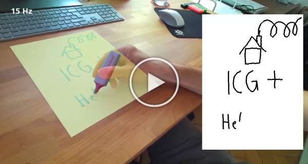

# ICG+: Extended Iterative Corresponding Geometry

## Paper
Fusing Visual Appearance and Geometry for Multi-modality 6DoF Object Tracking  
Manuel Stoiber, Mariam Elsayed, Anne E. Reichert, Florian Steidle, Dongheui Lee, Rudolph Triebel  
Submitted to IEEE/RSJ International Conference on Intelligent Robots (IROS) 2023  
[preprint](https://arxiv.org/pdf/2302.11458.pdf)

## Abstract
In many applications of advanced robotic manipulation, six degrees of freedom (6DoF) object pose estimates are continuously required. In this work, we develop a multi-modality tracker that fuses information from visual appearance and geometry to estimate object poses. The algorithm extends our previous method ICG, which uses geometry, to additionally consider surface appearance. In general, object surfaces contain local characteristics from text, graphics, and patterns, as well as global differences from distinct materials and colors. To incorporate this visual information, two modalities are developed. For local characteristics, keypoint features are used to minimize distances between points from keyframes and the current image. For global differences, a novel region approach is developed that considers multiple regions on the object surface. In addition, it allows the modeling of external geometries. Experiments on the YCB-Video and OPT datasets demonstrate that our approach ICG+ performs best on both datasets, outperforming both conventional and deep learning-based methods. At the same time, the algorithm is highly efficient and runs at more than 300 Hz. The source code of our tracker is publicly available.

## Video
<a href="https://www.youtube.com/watch?v=NfNzxXupX54">
<p align="center">
 
    <br> 
    <em>Fusing Visual Appearance and Geometry for Multi-Modality 6DoF Object Tracking</em>
</p>
</a>

## Code
The *ICG+* tracker was fully integrated into the multi-body, multi-modality, and multi-camera tracking library *M3T*. In contrast to *ICG+*, *M3T* provides additional functionality, such as the tracking of kinematic structures. Note that it was ensured that the evaluation results for *ICG+* and *M3T* are exactly the same. If you would like to reproduce results from our publication or use the tracker in your own application, please use the code from *M3T* from the following [directory](https://github.com/DLR-RM/3DObjectTracking/tree/master/M3T).

## Evaluation
The [code](https://github.com/DLR-RM/3DObjectTracking/tree/master/M3T/examples) in `examples/evaluate_ycb_dataset.cpp`, `examples/evaluate_opt_dataset.cpp`, `examples/parameters_study_ycb.cpp`, and `examples/parameters_study_opt.cpp` was used for the evaluation on the [YCB-Video](https://rse-lab.cs.washington.edu/projects/posecnn/) and [OPT](http://media.ee.ntu.edu.tw/research/OPT/) datasets. To reproduce results, please download the datasets and adjust the parameters `dataset_directory` in the source code. Note that files for sparse viewpoint models (e.g. 002_master_chef_can_depth_model.bin, 002_master_chef_can_region_model.bin, ...) will be created automatically and are stored in specified `external_directory` folders. For the evaluation of the *YCB-Video* dataset, please unzip `data/ycb-video_poses.zip` and store its content in the corresponding `external_directory`. Also, for the evaluation of multi-region tracking, the content of the `data/ycb-video_multi-region_<X>.zip` files, which contain required .obj files, has to be copied into the `external_directory`. The .zip files can be found in the following [folder](https://github.com/DLR-RM/3DObjectTracking/tree/master/M3T/data).

## Citation
If you find our work useful, please cite us with: 

```
@InProceedings{Stoiber_2023_IROS,
    author = {Stoiber, Manuel and Elsayed, Mariam and Rechert, Anne E. and Steidle, Florian and Lee, Dongheui and Triebel, Rudolph},
    title  = {Fusing Visual Appearance and Geometry for Multi-Modality 6DoF Object Tracking},
    year   = {2023},
}
```
