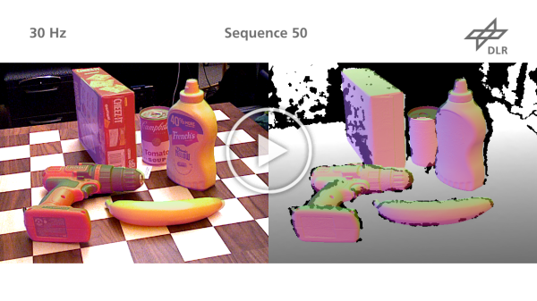
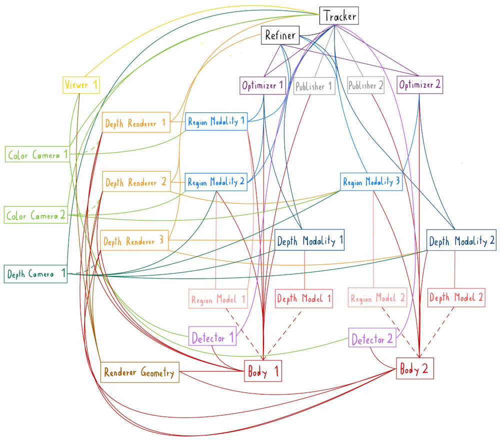

# ICG: Iterative Corresponding Geometry

## Paper
Iterative Corresponding Geometry: Fusing Region and Depth for Highly Efficient 3D Tracking of Textureless Objects  
Manuel Stoiber, Martin Sundermeyer, Rudolph Triebel  
Conference on Computer Vision and Pattern Recognition (CVPR) 2022  
[Paper](https://arxiv.org/abs/2203.05334)

## Abstract
Tracking objects in 3D space and predicting their 6DoF pose is an essential task in computer vision. State-of-the-art approaches often rely on object texture to tackle this problem. However, while they achieve impressive results, many objects do not contain sufficient texture, violating the main underlying assumption. In the following, we thus propose ICG, a novel probabilistic tracker that fuses region and depth information and only requires the object geometry. Our method deploys correspondence lines and points to iteratively refine the pose. We also implement robust occlusion handling to improve performance in real-world settings. Experiments on the YCB-Video, OPT, and Choi datasets demonstrate that, even for textured objects, our approach outperforms the current state of the art with respect to accuracy and robustness. At the same time, ICG shows fast convergence and outstanding efficiency, requiring only 1.3 ms per frame on a single CPU core. Finally, we analyze the influence of individual components and discuss our performance compared to deep learning-based methods. The source code of our tracker is publicly available.

## Videos
<a href="https://youtu.be/qMr1RHCsnDk?t=10">
<p align="center">
 
    <br> 
    <em>Real-World Experiments</em>
</p>
</a>

<a href="https://youtu.be/qMr1RHCsnDk?t=143">
<p align="center">
 
    <br> 
    <em>Evaluation on the YCB-Video Dataset</em>
</p>
</a>

## Code
The following library is able to consider images from multiple depth and color cameras and fuses information from depth and region modalities to simultaneously predict the pose of multiple objects. It is able to consider unknown occlusions using depth camera measurements or model known occlusions using depth renderers. The algorithm is highly efficient and typically requires about 1-2ms per frame on a single CPU core for the tracking of a single object. To support a wide range of camera configurations and various object characteristics, the overall framework is very modular and allows a flexible combination of different components such as cameras, modalities, viewers, object detectors, refiners, and publishers.

### Content
The repository is organized in the following folders:
- `include/`: header files of the *ICG* library
- `src/`: source files of the *ICG* library
- `third_party/`: external header-only libraries
- `examples/`: example files for tracking as well as for evaluation on different datasets
- `doc/`: files for documentation

### Build
Use `CMake` to build the library from source. The following dependencies are required: [Eigen 3](https://eigen.tuxfamily.org/index.php?title=Main_Page), [GLEW](http://glew.sourceforge.net/), [GLFW 3](https://www.glfw.org/), and [OpenCV 4](https://opencv.org/). In addition, images from an Azure Kinect or RealSense camera can be streamed using the [K4A](https://github.com/microsoft/Azure-Kinect-Sensor-SDK) and [realsense2](https://github.com/IntelRealSense/librealsense) libraries. Both libraries are optional and can be disabled using the *CMake* flags `USE_AZURE_KINECT`, and `USE_REALSENSE`. If *CMake* finds [OpenMP](https://www.openmp.org/), the code is compiled using multithreading and vectorization for some functions. Finally, the documentation is built if [Doxygen](https://www.doxygen.nl/index.html) with *dot* is detected. Note that links to classes that are embedded in this readme only work in the generated documentation.

### Tracking Process
The tracking process is coordinated by the [Tracker](classicg_1_1Tracker.html) class. It executes the main methods of different components in the correct order. An overview of the major steps is shown in the following illustration:

<pre>
 1: Update cameras
 2: Detect bodies
 3: Refine poses
 4: Update viewers
 5: Start modalities
 6: <b>while</b> tracking <b>do</b>
 7:     Update cameras
 8:     <b>for</b> n_corr_iterations <b>do</b>
 9:         Calculate correspondences
10:         <b>for</b> n_update_iterations <b>do</b>
11:             Calculate gradient and Hessian
12:             Calcualte pose optimization
13:         <b>end for</b>
14:     <b>end for</b>
15:     Update modalities
16:     Update publishers
17:     Update viewers
18: <b>end while</b>
</pre>

Typically, tracking is started by updating the images from all cameras, detecting all objects in the image with a rough pose, refining the pose, and showing a visualization of the current estimate in the viewer. Having an initial pose estimate, modalities are started. After initialization, the tracking cycle is executed. First, all cameras are updated. This is followed by an iterative process to estimate the pose. It starts by calculating correspondences for all modalities. Subsequently, based on those correspondences, gradient vectors and Hessian matrices are calculated for all modalities. For each object, an optimizer then combines gradient vectors and Hessian matrices from corresponding modalities to update the object's pose. Like the main cycle that includes the calculation of correspondences, this optimization process can be executed multiple times. After the final pose has been found, modalities are updated based on the obtained results. Finally, publishers that transmit data to external entities are executed and viewers visualize the final estimate.

### Main Components
The library consists of multiple components with specific functionality that allow a flexible configuration of the tracker. The following main components exist:
- **Body:** Contains the geometry of a rigid body and stores the pose of the body relative to a world coordinate frame. It is implemented in the [Body](classicg_1_1Body.html) class.
- **RendererGeometry:** Loads geometric information from referenced `Body` objects and provides everything required for rendering. It is implemented in the [RendererGeometry](classicg_1_1RendererGeometry.html) class.
- **Renderer:** Creates a rendering based on the geometry stored in the `RendererGeometry`, the pose of referenced `Body` objects, and the view of the renderer on the scene defined by intrinsics and the renderer pose. For tracking, intrinsics and the pose are typically inferred from the values of a corresponding `Camera` object. Both `FullRenderers`, which render an image according to intrinsics, and `FocusedRenderers`, which focus on referenced bodies and render an image with a defined size that is scaled and cropped to only include the referenced bodies, exist. For occlusion handling, `FocusedRenderer` objects are used. Based on the data in the `RendererGeometry`, different bodies can be considered. Depth images are obtained by the [FullBasicDepthRenderer](classicg_1_1FullBasicDepthRenderer.html) and [FocusedBasicDepthRenderer](classicg_1_1FocusedBasicDepthRenderer.html) classes. Normal images that encode the surface normal vector in pixel colors can be created using the [FullNormalRenderer](classicg_1_1FullNormalRenderer.html) and [FocusedNormalRenderer](classicg_1_1FocusedNormalRenderer.html) classes.
- **Camera:** Provides images to other components and contains intrinsics as well as the pose of the camera relative to the world coordinate frame. Both `ColorCamera` and `DepthCamera` classes exist. Information can be loaded using the [LoaderColorCamera](classicg_1_1LoaderColorCamera.html) and [LoaderDepthCamera](classicg_1_1LoaderDepthCamera.html) classes. To stream data from a physical Azure Kinect or RealSense camera, the [AzureKinectColorCamera](classicg_1_1AzureKinectColorCamera.html), [AzureKinectDepthCamera](classicg_1_1AzureKinectDepthCamera.html), [RealSenseColorCamera](classicg_1_1RealSenseColorCamera.html), and [RealSenseDepthCamera](classicg_1_1RealSenseDepthCamera.html) classes are used.
- **Viewer:** Visualizes different data. The [ImageColorViewer](classicg_1_1ImageColorViewer.html) and [ImageDepthViewer](classicg_1_1ImageDepthViewer.html) classes visualize images from a referenced `ColorCamera` and `DepthCamera`. The [NormalColorViewer](classicg_1_1NormalColorViewer.html) and [NormalDepthViewer](classicg_1_1NormalDepthViewer.html) classes overlay camera images with normal renderings that are based on the data from a referenced `RendererGeometry` object. They are used to visualize the current pose estimate.
- **Model:** Precomputes and stores geometric information from `Body` objects that is required by `Modality` objects during tracking. Modalities that track the same object class and consider the same type of information can use the same `Model`. For the `RegionModality`, a [RegionModel](classicg_1_1RegionModel.html) class is implemented while the `DepthModality` uses the [DepthModel](classicg_1_1DepthModel.html) class.
- **Modality:** Considers information from a `Camera`, `Body`, and `Model` object to calculate the gradient vector and Hessian matrix that are used by an `Optimizer` to update the object pose. To consider region information from a `ColorCamera`, the [RegionModality](classicg_1_1RegionModality.html) class is used while the [DepthModality](classicg_1_1DepthModality.html) class considers measurements from a `DepthCamera`. To model known occlusions, both modalities allow referencing a `FocusedDepthRenderer`. The `RegionModality` also allows referencing an additional `DepthCamera` that is close to the `ColorCamera` to recognize unknown occlusions.
- **Optimizer:** References all `Modality` objects that consider the same `Body`. The gradient vectors and Hessian matrices from those `Modality` objects are used to update the pose of the referenced `Body`. It is implemented in the [Optimizer](classicg_1_1Optimizer.html) class.
- **Detector:** Sets the pose of a referenced `Body`. While the [StaticDetector](classicg_1_1StaticDetector.html) class sets a pre-defined pose, the [ManualDetector](classicg_1_1ManualDetector.html) class allows the user to select 4 object points in an image from a `ColorCamera` to compute the pose.
- **Publisher:** Writes data to an external source. Currently, no `Publisher` is implemented.
- **Refiner:** Coordinates `Optimizer`, `Modality`, and `Renderer` objects to refine the pose of multiple `Body` objects. The overall process is very similar to the two inner loops of the iterative pose optimization process that was described previously. The main exception is only that modalities are started every time before correspondences are calculated. Functionality is implemented in the [Refiner](classicg_1_1Refiner.html) class.
- **Tracker:** Coordinates all `Refiner`, `Publisher`, `Detector`, `Optimizer`, `Modality`, `Renderer`, `Viewer`, and `Camera` objects. The overall tracking process was described previously. All functionality is implemented in the [Tracker](classicg_1_1Tracker.html) class.

Based on those components, a tracker can be configured. An example of a tracker that tracks two bodies using information from two color cameras and one depth camera is shown in the following illustration: 



Based on the geometry of *Body 1* and *Body 2*, region and depth models are generated before the tracking starts. The relation is illustrated by dashed lines. The models are then used by the respective modalities. To track *Body 1*, two region modalities that reference data from the two color cameras and a depth modality that considers data from the depth camera are used. For *Body 2*, a single region modality that considers information from *Color Camera 2* and a depth modality that uses data from the depth camera are employed. Information from the modalities of *Body 1* and *Body 2* is combined in the respective optimizers *Optimizer 1* and *Optimizer 2*. All depth modalities model occlusions using depth renderers. Renderer objects were thereby initialized from a corresponding camera. This is indicated by dashed lines. Note that all renderers reference *Body 1* and *Body 2* to focus the scene on those bodies and ensure that they are fully visible and at the same time fill the rendered images. Geometry information that is required for the rendering is referenced from the *RendererGeometry* object. In addition to modeling occlusions using renderers, depth measurements can also be considered. For this, *Region Modality 1* and *Region Modality 3* reference information from the *Depth Camera 1*, which is located close to *Color Camera 2*. To initialize the pose of both objects, two detectors that consider images from *Color Camera 1* are used. The pose is then refined by the *Refiner* object which takes into account all available information from *Optimizer 1* and *Optimizer 2*. The current predictions are visualized by *Viewer 1* which considers the scene provided by the *Renderer Geometry* and visualizes it on images from *Color Camera 1*. The entire process is coordinated by the *Tracker*, which references all required objects.

### Usage
As explained previously, *ICG* is a library that supports a wide variety of tracking scenarios. As a consequence, to start tracking, one has to first configure the tracker. For this, two options exist:

- One option is to use *C++* programming to set up and configure all objects according to ones scenario. An example that allows running the tracker on a sequence streamed from an AzureKinect is shown in `examples/run_on_camera_sequence.cpp`. The executable thereby takes the path to a directory and names of multiple bodies. The directory has to contain `Body` and `StaticDetector` metafiles that are called `<BODY_NAME>.yaml` file and `<BODY_NAME>_detector.yaml`. Similarly, `examples/run_on_recorded_sequence.cpp` allows to run the tracker on a sequence that was recorded using `record_camera_sequence.cpp`. The executable allows the tracking of a single body that is detected using a `ManualDetector`. It requires the metafiles for a `LoaderColorCamera`, `Body`, and `ManualDetector`, as well as the path to a temporary directory in which generated model files are stored. 

- In addition to the usage as a library in combination with *C++* programming, the tracker can also be configured using a generator function together with a YAML file that defines the overall configuration. A detailed description on how to set up the YAML file is given in [Generator Configfile](generator.html). An example that shows how to use a generator is shown in `examples/run_generated_tracker.cpp`. The executable requires a YAML file that is parsed by the `GenerateConfiguredTracker()` function to generate a `Tracker` object. The main YAML file thereby defines how individual objects are combined and allows to specify YAML metafiles for individual components that do not use default parameters. An example of a YAML file is given in `examples\generator_example\config.yaml`.

In addition to constructors and setter methods, the parameters of all components can be defined in YAML metafiles. The most important metafiles and parameters are thereby:

#### Body
```
geometry_path: "INFER_FROM_NAME"
geometry_unit_in_meter: 1.0
geometry_counterclockwise: 1
geometry_enable_culling: 1
geometry2body_pose: !!opencv-matrix
  rows: 4
  cols: 4
  dt: d
  data: [ 1., 0, 0, 0,
          0, 1., 0, 0,
          0, 0, 1., -0.006,
          0, 0, 0, 1. ]
```
- `geometry_path`: path to wavefront obj file. Using `INFER_FROM_NAME` sets the path to `<BODY_NAME>.obj`.
- `geometry_unit_in_meter`: scale factor to scale the unit used in the wavefront obj file to meter.
- `geometry_counterclockwise`: true if winding order of triangles in wavefront obj is defined counter-clockwise.
- `geometry_enable_culling`: true if faces that are not facing toward the camera should be culled.
- `geometry2body_pose`: transformation that allows to set a different frame of reference for the object than defined by the wavefront obj file.

#### DepthModel / RegionModel
```
model_path: "INFER_FROM_NAME"
```
- `model_path`: path to .bin file where the sparse viewpoint model is stored or where it should be generated. Using `INFER_FROM_NAME` sets the path to `<MODEL_NAME>.bin`.

#### StaticDetector
```
body2world_pose: !!opencv-matrix
  rows: 4
  cols: 4
  dt: d
  data: [0.607674, 0.786584, -0.10962, -0.081876,
          0.408914, -0.428214, -0.805868, -0.00546736,
          -0.680823, 0.444881, -0.58186, 0.618302,
          0, 0, 0, 1 ]
```
- `body2world_pose`: transformation between body and world (typically camera frame) to which the body is set by the detector.

#### ManualDetector
```
reference_points:
  - [ -0.0332, 0.0, 0.0]
  - [ 0.0192, -0.0332, 0.0]
  - [ 0.0192, 0.0332, 0.0]
  - [ 0.0, 0.0, 0.0]
detector_image_path: "./detector_image.png"
```
- `reference_points`: 3D points on the object surface given in the body frame. During manual detection, the user has to specify the corresponding 2D coordinates of those points in the image to define the object pose.
- `detector_image_path`: optional image that illustrates on which points the user has to click.

#### LoaderColorCamera / LoaderDepthCamera
```
load_directory: "./"
intrinsics:
   f_u: 638.633
   f_v: 638.377
   pp_x: 639.451
   pp_y: 366.379
   width: 1280
   height: 720
camera2world_pose: !!opencv-matrix
   rows: 4
   cols: 4
   dt: f
   data: [ 1., 0., 0., 0.,
            0., 1., 0., 0.,
            0., 0., 1., 0.,
            0., 0., 0., 1. ]
depth_scale: 0.001    # only for depth camera
image_name_pre: "color_camera_image_"
load_index: 0
n_leading_zeros: 0
image_name_post: ""
load_image_type: "png"
```
- `load_directory`: directory from which images are loaded.
- `intrinsics`: intrinsics of the camera that was used to record images, with fu, fv, ppu, ppv, width, and height, respectively.
- `depth_scale`: scale with which pixel values have to be multiplied to get the depth in meter. (only required for depth cameras)
- `image_name_pre`: text at the beginning of image name, before load_index.
- `load_index`: index of the first image that is loaded.
- `n_leading_zeros`: minimum number of digits used in the image name with zero padding to reach correct number.
- `image_name_post`: text at the end of image name, after load_index.
- `load_image_type`: file format of images.

To start tracking your own objects, we recommend defining your own metafile for `Body` and `StaticDetector` and use the `examples/run_on_camera_sequence.cpp`. Note that depending on the parameters for the `RunTrackerProcess` function of the `Tracker` class, detection and tracking will not start automatically. To start the detection, please press the D key on your keyboard. For tracking, the T key has to be pressed. To quit the application, press Q. If you would like to use the RealSense camera instead of the AzureKinect, please replace `#include <icg/azure_kinect_camera.h>` with `#include <icg/realsense_camera.h>` and all occurences of `AzureKinectColorCamera` and `AzureKinectDepthCamera` with `RealSenseColorCamera` and `RealSenseDepthCamera`. If you would like to use another camera than the RealSense or Azure Kinect, we encourage you to create a class similar to the `AzureKinectCamera` class in src/azure_kinect_camera.cpp. To use results from the tracker in your own application, you can implement your own `Publisher` class that implements the method `UpdatePublisher()`.

In addition to this short overview, detailed information on all objects and parameters can be found in the [Documentation](annotated.html), which can be generated using *Doxygen* with *dot*.

### Evaluation
The code in `examples/evaluate_<DATASET_NAME>_dataset.cpp` and `examples/parameters_study_<DATASET_NAME>.cpp` contains everything for the evaluation on the *YCB-Video*, *OPT*, *Choi*, and *RBOT* datasets. For the evaluation, please download the [YCB-Video](https://rse-lab.cs.washington.edu/projects/posecnn/), [OPT](http://media.ee.ntu.edu.tw/research/OPT/), [Choi](http://people.ece.umn.edu/~cchoi/research_rgbdtracking.html), or [RBOT](http://cvmr.info/research/RBOT/) dataset and adjust the `dataset_directory` in the source code. Note that model files (e.g. 002_master_chef_can_depth_model.bin, 002_master_chef_can_region_model.bin, ...) will be created automatically and are stored in the specified `external_directory`. For the evaluation of the *YCB-Video* dataset, please unzip `poses_ycb-video.zip` and store its content in the respective `external_directory`. For the *Choi* dataset, the *Matlab* script in `examples/dataset_converter/convert_choi_dataset.m` has to be executed to convert .pcd files into .png images. Also, using a program such as *MeshLab*, all model files have to be converted from .ply to .obj files and stored in the folder `external_directory/models`. Both the *OPT* and *RBOT* datasets work without any manual changes.

## Citation
If you find our work useful, please cite us with: 

```
@InProceedings{Stoiber_2022_CVPR,
    author    = {Stoiber, Manuel and Sundermeyer, Martin and Triebel, Rudolph},
    title     = {Iterative Corresponding Geometry: Fusing Region and Depth for Highly Efficient 3D Tracking of Textureless Objects},
    booktitle = {Proceedings of the IEEE/CVF Conference on Computer Vision and Pattern Recognition (CVPR)},
    year      = {2022}
}
```
