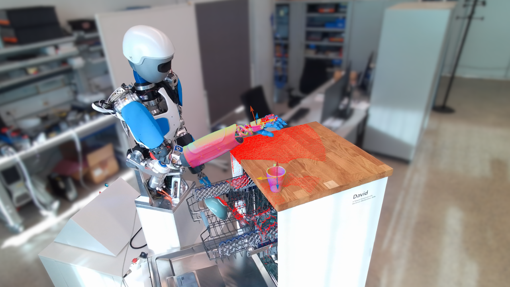
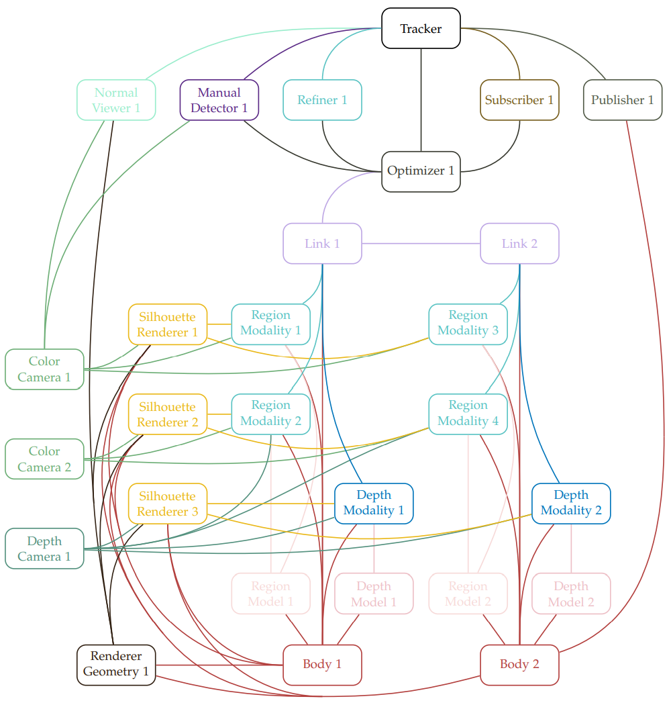

# M3T: A Multi-body Multi-modality Multi-camera 3D Tracker

## Publication
Closing the Loop: 3D Object Tracking for Advanced Robotic Manipulation  
Manuel Stoiber  
Dissertation submitted to the Technical University of Munich


## Introduction
Tracking objects and kinematic structures and determining their poses and configurations is an essential task in computer vision. Its application ranges from augmented reality to robotic perception. Given 3D meshes and kinematic information, the goal is to robustly estimate both the rotation and translation of each body. The *M3T* library is able to consider images from multiple depth and color cameras. It allows to fuse information from depth, region, and texture modalities to simultaneously predict the pose and configuration of multiple multi-body objects. *M3T* is able to consider unknown occlusions using depth camera measurements or model known occlusions using depth and silhouette renderers. The algorithm is highly efficient and is able to provide results in real time, even for complex kinematic structures. To support a wide range of kinematic structures, object characteristics, and camera configurations, the overall framework is very modular and allows a flexible combination of different components such as cameras, links, constraints, modalities, viewers, detectors, refiners, publishers, and subscribers.




## Content
The repository is organized in the following folders:
- `include/`: header files of the *M3T* library
- `src/`: source files of the *M3T* library
- `third_party/`: external header-only libraries
- `test/`: unit tests
- `data/`: data that is required for examples and unit tests
- `examples/`: example files for tracking as well as for evaluation on different datasets
- `doc/`: files for documentation


## Build
Use [CMake](https://cmake.org/) to build the library from source. The following dependencies are required: [Eigen 3](https://eigen.tuxfamily.org/index.php?title=Main_Page), [GLEW](http://glew.sourceforge.net/), [GLFW 3](https://www.glfw.org/), and [OpenCV 4](https://opencv.org/). In addition, unit tests are implemented using [gtest](https://github.com/google/googletest), while images from an Azure Kinect or RealSense camera can be streamed using the [K4A](https://github.com/microsoft/Azure-Kinect-Sensor-SDK) and [realsense2](https://github.com/IntelRealSense/librealsense) libraries. All three libraries are optional and can be disabled using the *CMake* flags `USE_GTEST`, `USE_AZURE_KINECT`, and `USE_REALSENSE`. If [OpenCV 4](https://opencv.org/) is installed with [CUDA](https://developer.nvidia.com/cuda-downloads), feature detectors used in the texture modality are able to utilize the GPU. If *CMake* finds [OpenMP](https://www.openmp.org/), the code is compiled using multithreading and vectorization for some functions. Finally, the documentation is built if [Doxygen](https://www.doxygen.nl/index.html) with *dot* is detected. Note that links to pages or classes that are embedded in this readme only work in the generated documentation. After a correct build, it should be possible to successfully execute all tests in `./gtest_run`. For maximum performance, ensure that the library is created in `Release` mode, and, for example, use `-DCMAKE_BUILD_TYPE=Release`.


## Algorithm

In the following, the tracking algorithm is described in detail. For this, we introduce the overall process executed by the tracker, describe the used components, and explain how they have to be configured. 

### Tracker Process
The tracking process is coordinated by the `Tracker` object. Usually, only a single tracker exists that references all relevant components. Using the method `RunTrackerProcess`, the tracker executes the main methods of different components in the correct order. It considers the state of individual kinematic structures represented by `Optimizer` objects. In general, they can be in the states *detecting*, *starting*, and *tracking*. Also, kinematic structures may be idle. States can be influenced by the user with the methods `StartTracking`, `StopTracking`, and `ExecuteDetection`. Each method allows to specify names of optimizers to affect the respective kinematic structures.  In addition, it is possible to change the state of all kinematic structures by pressing the `T` key to start tracking, the `S` key to stop tracking, the `D` key to start the detection, and the `X` key to start the detection and directly start tracking. With `QuitTrackerProcess` or the `Q` key, one can quit the tracking process. 

Each iteration of the tracker process starts with an update of all `Camera` and `Subscriber` objects. Subsequently, given that `Subscriber` objects are able to change the poses of individual `Link` and `Body` objects, poses are updated to be consistent. After that, *Detecting*, *Starting*, and *Tracking Steps* are executed. Each step only considers objects associated with kinematic structures in the corresponding state. Finally, once individual steps have been finished, `Publishers` and `Viewers` are updated. The process then starts from the beginning. An overview of the major steps in the tracker process is shown in the following algorithm:
<pre>
<b>Tracker Process:</b>
 1: <b>while</b> run tracker process <b>do</b>
 2:     Update all Camera objects
 3:     Update all Subscriber objects
 4:     Calculate consistent Link and Body poses
 5:     Run <i>Detecting Step</i> (for objects associated with the state <i>detecting</i>)
 6:     Run <i>Starting Step</i> (for objects associated with the state <i>starting</i>)
 7:     Run <i>Tracking Step</i> (for objects associated with the state <i>tracking</i>)
 8:     Update all Publisher objects
 9:     Update all Viewer objects
10: <b>end while</b>
</pre>

For the *Detecting Step*, first, all `Detector` objects associated with the state *detecting* are run. If the detection is successful, the `Detector` updates the poses of all `Link` and `Body` objects in the kinematic structure. Subsequently, for all kinematic structures that were successfully detected, associated `Refiner` objects improve predictions. Finally, if desired, successfully detected structures move to the state *starting*. An overview of the *Detecting Step* is shown in the following algorithm:

<pre>
<b>Detecting Step:</b>
 1: Run Detector objects
 2: Run Refiner objects for successful detections
 3: If desired, move to state <i>starting</i> for successful detections
</pre>

In the *Starting Step*, first, all `Renderer` objects that are required by `Modality` objects are executed. After that, each `Modality` is started. This operation, for example, initializes internal color histograms of `RegionModality` objects. Subsequently, the *Starting Step* also performs the initialization of shared `ColorHistograms` objects. Finally, each kinematic structure automatically moves into the state *tracking*. An overview of the individual steps is shown in the following algorithm:

<pre>
<b>Starting Step:</b>
 1: Run Renderer objects required for the starting of Modality objects
 2: Start Modality objects
 3: Initialize ColorHistograms objects
 4: Move to state <i>tracking</i>
</pre>

Finally, the *Tracking Step* considers the estimation of poses by iteratively computing correspondences and pose updates. To calculate correspondences for `Modality` objects, it first runs required `Renderer` objects. Typical examples are `SilhouetteRenderer` objects that are used to validate individual contour or surface points. Afterwards, correspondences are calculated. This is typically followed by two update iterations. In each iteration, gradient vectors and Hessian matrices are calculated for all `Modality` objects. Afterwards, kinematic structures are updated. `Optimizer` objects thereby compute gradient vectors and Hessian matrices of `SoftConstraint` objects, calculate the Jacobian of each `Link` object, compute Jacobians and residuals of `Constraint` objects, and, finally, assemble everything in a single linear system of equations. `Optimizer` objects then solve the equations and update the poses of all `Link` and `Body` objects. Subsequently, the iterations are repeated. Finally, after the last iteration, required `Renderer` objects are run, and `Modality` and `ColorHistograms` objects are updated. An overview of the individual steps is shown in the following algorithm:

<pre>
<b>Tracking Step:</b>
 1: <b>for</b> n_corr_iterations <b>do</b>
 2:     Run Renderer objects required for the calculation of correspondences
 3:     Calculate correspondences for Modality objects
 4:     <b>for</b> n_update_iterations <b>do</b>
 5:         Calculate gradients and Hessians for Modality objects
 6:         <b>for</b> all Optimizer objects <b>do</b>
 7:             Calculate gradients and Hessians of referenced SoftConstraint objects
 8:             Calculate Jacobians of referenced Link objects
 9:             Calculate Jacobians and residuals of referenced Cosntraint objects
10:             Assemble and solve linear system of equations
11:             Update poses of referenced Link and Body objects
12:         <b>end for</b>
13:     <b>end for</b>
14: <b>end for</b>
15: Run Renderer objects for the update of Modality objects
16: Update Modality objects
17: Update ColorHistograms objects
</pre>

### Main Components
The library consists of multiple components that provide specific functionality and data. They allow a flexible configuration of the tracker. The following main components exist (note that links only work in the Doxygen documentation):
- **Camera:** Specifies the abstract method `UpdateImage` to fetch images and provides those images to other components. In addition, it stores intrinsics and defines the camera's pose relative to the world coordinate frame. In general, one differentiates between `ColorCamera` and `DepthCamera` classes. Currently, different implementations exist. To load images from disk, the [LoaderColorCamera](classm3t_1_1LoaderColorCamera.html) and [LoaderDepthCamera](classm3t_1_1LoaderDepthCamera.html) classes are used. To stream data from a physical Azure Kinect or RealSense camera, the [AzureKinectColorCamera](classm3t_1_1AzureKinectColorCamera.html), [AzureKinectDepthCamera](classm3t_1_1AzureKinectDepthCamera.html), [RealSenseColorCamera](classm3t_1_1RealSenseColorCamera.html), and [RealSenseDepthCamera](classm3t_1_1RealSenseDepthCamera.html) classes are used.
- **Body:** Holds the pose of a rigid body relative to the world coordinate frame and stores the body's mesh geometry. It also specifies values for region and body IDs that are used in the rendering of silhouette images. It is implemented in the [Body](classm3t_1_1Body.html) class.
- **RendererGeometry:** Stores geometric information from referenced `Body` objects on the GPU and provides everything required for rendering. It is implemented in the [RendererGeometry](classm3t_1_1RendererGeometry.html) class.
- **Renderer:** Creates a rendering based on the geometry stored in a referenced `RendererGeometry` object, the pose of corresponding `Body` objects, the view of the renderer on the scene defined by intrinsics, and the renderer's pose relative to the world coordinate frame. For tracking, intrinsics and the pose are typically inferred from the values of a corresponding `Camera` object. Both `FullRenderers`, which render an image according to intrinsics, and `FocusedRenderers`, which focus on referenced bodies and render an image with a defined size that is scaled and cropped to only include the referenced bodies, exist. For occlusion handling, region checking, and silhouette checking, `FocusedRenderer` objects are used. Based on the data in the `RendererGeometry`, different bodies can be considered. Depth images are obtained by the [FullBasicDepthRenderer](classm3t_1_1FullBasicDepthRenderer.html) and [FocusedBasicDepthRenderer](classm3t_1_1FocusedBasicDepthRenderer.html) classes. Silhouette images that contain either region or body IDs from `Body` objects can be created using the [FullSilhouetteRenderer](classm3t_1_1FullSilhouetteRenderer.html) and [FocusedSilhouetteRenderer](classm3t_1_1FocusedSilhouetteRenderer.html) classes. Normal images that encode the surface normal vector in pixel colors can be created using the [FullNormalRenderer](classm3t_1_1FullNormalRenderer.html) and [FocusedNormalRenderer](classm3t_1_1FocusedNormalRenderer.html) classes.
- **Model:** Precomputes geometric information from a referenced `Body` and stores the created data. During the generation, geometries from external `Body` objects can also be considered.	This can, for example, be used to consider known occlusions before tracking. Two versions exist: a [RegionModel](classm3t_1_1RegionModel.html) that samples contour points and a [DepthModel](classm3t_1_1DepthModel.html) that computes surface points. They are used for `RegionModality` and `DepthModality` objects, respectively. Modalities that consider the same geometry can use the same model.
- **ColorHistograms:** Computes and holds color histograms for the foreground and background. Typically, the object is incorporated in the `RegionModality`. However, if histograms should be shared, `ColorHistograms` can also be defined separately and referenced by multiple modalities. It is implemented in the [ColorHistograms](classm3t_1_1ColorHistograms.html) class.
- **Modality:** Considers information from a `Camera` and `Body` to calculate the gradient vector and Hessian matrix used for Newton optimization. Currently, three `Modality` classes exist: a [RegionModality](classm3t_1_1RegionModality.html) that sparsely considers region information and requires a `ColorCamera`, `Body`, and `RegionModel`, a [DepthModality](classm3t_1_1DepthModality.html) that implements an ICP-like depth approach that considers data from a `DepthCamera`, `Body`, and `DepthModel`, and a [TextureModality](classm3t_1_1TextureModality.html) that uses keypoint features and requires information from a `ColorCamera`, `Body`, and `SilhouetteRenderer`. Both the `RegionModality` and `TextureModality` allow to reference an additional `DepthCamera` that is close to the `ColorCamera` to recognize unknown occlusions. To model known occlusions, modalities allow referencing a `FocusedDepthRenderer`. Finally, for the validation of contour points and surface points, `RegionModality` and `DepthModality` objects use a `SilhouetteRenderer`. Also, `RegionModality` objects are able to reference external `ColorHistograms`.
- **Link:** Defines the location of a joint reference frame relative to the reference frame of the [Link](classm3t_1_1Link.html) and its parent.	For the joint, rotational and translational motion along defined coordinate axes is allowed. To build a tree-like kinematic structure, a `Link` is able to reference multiple `Link` objects as children.	In general, `Link` objects contain all `Modality` objects that correspond to a single referenced `Body`. If a `Body` is configured, the reference frame of the `Link` is equal to that of the `Body`.	Also, it is possible to create virtual `Link` objects without referenced `Body` or `Modality` objects to allow the definition of kinematics that do not feature visual information.
- **Constraint:** Takes two `Link` objects and defines the location of joint reference frames relative to corresponding link frames. Rotational and translational motion between the two joint frames is constrained for user-defined coordinate axes. It is implemented in the [Constraint](classm3t_1_1Constraint.html) class.
- **SoftConstraint:** Like the `Constraint`, it takes two `Link` objects and defines the location of joint reference frames relative to corresponding link frames. Also, rotational and translational motion between the two joint frames is again constrained for user-defined coordinate axes. However, in contrast to the `Constraint` class, a standard deviation and a maximum distance for which the constraint remains inactive can be defined. It is implemented in the [SoftConstraint](classm3t_1_1SoftConstraint.html) class.
- **Optimizer:** References a single `Link` at the root of a kinematic structure and multiple corresponding `Constraint` and `SoftConstraint` objects. It computes Jacobian matrices for all `Link` objects and uses them to project gradient vectors and Hessian matrices from `Modality` and `SoftConstraint` objects to the full gradient and Hessian required for Newton optimization. In addition, an `Optimizer` projects Jacobians and residuals from `Constraint` objects into the full system of linear equations. After a single Newton step, it updates the pose of all `Link` and `Body` objects in the kinematic structure. It is implemented in the [Optimizer](classm3t_1_1Optimizer.html) class.
- **Detector:** Depending on the implementation, a `Detector` is able to reference multiple `Optimizer` objects. Based on the detected pose of the root `Link`, it updates the pose of all corresponding `Link` and `Body` objects in the kinematic structure. Two detectors are implemented:	a [StaticDetector](classm3t_1_1StaticDetector.html) that assigns a predefined pose and a [ManualDetector](classm3t_1_1ManualDetector.html) that allows a user to define four points in a color image to infer the pose.
- **Viewer:** Is used to visualize the current pose estimate. While [ImageColorViewer](classm3t_1_1ImageColorViewer.html) and [ImageDepthViewer](classm3t_1_1ImageDepthViewer.html) classes simply visualize images from referenced `ColorCamera` and `DepthCamera` objects, [NormalColorViewer](classm3t_1_1NormalColorViewer.html) and [NormalDepthViewer](classm3t_1_1NormalDepthViewer.html) classes overlay camera images with normal renderings that are based on the data from a referenced `RendererGeometry` object.
- **Publisher:**  Is used to communicate data to an external source. It features the abstract method `UpdatePublisher` that is called at the end of the pose optimization. Its implementation is highly dependent on the information that should be exchanged. In most applications, it is used to publish predicted poses. Currently, no `Publisher` is implemented.
- **Subscriber:** Is used to read data from an external source.	It provides the abstract method `UpdateSubscriber` that is called before the optimization. As for the `Publisher` class, the implementation is highly dependent on the source and exchanged information. When the main method is executed, the tracker is in a defined state, without anything happening in parallel. A `Subscriber` can, therefore, not only modify pose predictions but is able to change settings or the entire configuration of referenced objects. Currently, no `Subscriber` is implemented.
- **Refiner:** References `Optimizer` objects to refine pose predictions of the corresponding kinematic structures. It thereby coordinates different methods provided by `Optimizer`, `Constraint`, `SoftConstraint`, `Link`, `Modality`, `ColorHistograms`, and `Renderer` objects.	The refinement process is very similar to the *Tracking Step*. The only main difference is that methods featured in the *Starting Step* are executed each time before correspondences are calculated. It is implemented in the [Refiner](classm3t_1_1Refiner.html) class.
- **Tracker:**  References `Optimizer`, `Refiner`, `Publisher`, `Subscriber`, `Viewer`, and `Detector` objects.	In addition to an orderly setup, it facilitates the entire tracking process. The `Tracker` thereby coordinates the execution of methods provided by different objects. To control the process, it provides interfaces to start the tracking, stop the tracking, and execute the detection of kinematic structures represented by an `Optimizer`. It is implemented in the [Tracker](classm3t_1_1Tracker.html) class.

### Example Configuration

Based on those components, a tracker can be configured. An example of a tracker that tracks a kinematic structure with two bodies using information from two color cameras and one depth camera is shown in the following illustration:



For each `Body` and `ColorCamera`, a `RegionModality` is configured. Similarly, each `Body` supports a `DepthModality`.	To validate points, each `Modality` references a `SilhouetteRenderer` that corresponds to a `Camera`. In addition, the `RegionModality` objects 2 and 4 consider occlusions using the `DepthCamera`. For initialization, a `ManualDetector` predicts the pose of the `Link` and `Body` number 1 and uses the `Optimizer` to update the kinematic structure. Afterwards, the estimate is improved using a `Refiner`. Also, a `Subscriber` is configured that has access to all objects connected to the `Optimizer`.	Finally, results are visualized using a `NormalViewer`, and pose estimates of `Body` number 2 are communicated using a `Publisher`.


## Usage

As explained previously, *M3T* is a library that supports a wide variety of tracking scenarios. As a consequence, to start tracking, one has to first configure the tracker. For this, two options exist:

- One option is to use *C++* programming to set up and configure all objects according to one's scenario. An example that allows running the tracker on a sequence streamed from an AzureKinect is shown in `examples/run_on_camera_sequence.cpp`. The executable thereby takes the path to a directory and names of multiple bodies. The directory has to contain `Body` and `StaticDetector` metafiles that are called `<BODY_NAME>.yaml` file and `<BODY_NAME>_detector.yaml`. Similarly, `examples/run_on_recorded_sequence.cpp` allows to run the tracker on a sequence that was recorded using `record_camera_sequence.cpp`. The executable allows the tracking of a single body that is detected using a `ManualDetector`. It requires the metafiles for a `LoaderColorCamera`, `Body`, and `ManualDetector`, as well as the path to a temporary directory in which generated model files are stored.

- In addition to the usage as a library in combination with *C++* programming, the tracker can also be configured using a generator function together with a YAML file that defines the overall configuration. A detailed description of how to set up the YAML file is given in the [documentation](generator.html) or the following [markdown file](https://github.com/DLR-RM/3DObjectTracking/tree/master/M3T/doc/high_level/generator.md). An example that shows how to use a generator is shown in `examples/run_generated_tracker.cpp`. The executable requires a YAML file that is parsed by the `GenerateConfiguredTracker()` function to generate a `Tracker` object. The main YAML file thereby defines how individual objects are combined and allows to specify YAML metafiles for individual components that do not use default parameters. An example of a simple YAML file is given in `data/pen_paper_demo/conig.yaml`. The example can be executed using `examples/run_pen_paper_demo.cpp`. In the code, a dedicated `Publisher` class is implemented that visualizes the drawing of a stabilo pen on a paper. The example runs out of the box using the configuration and data provided in the `data/pen_paper_demo` directory. Finally, more complex examples for the configuration of kinematic structures using YAML files are provided in the *RTB* datast, which can be downloaded from [Zenodo](https://zenodo.org/record/7548537).

In addition to constructor and setter methods, the parameters of all components can be defined using YAML metafiles. Parameter names in the YAML file are thereby defined to be equal to names used in the code. The most important metafiles and parameters are:

#### Body
```
geometry_path: "INFER_FROM_NAME"
geometry_unit_in_meter: 1.0
geometry_counterclockwise: 1
geometry_enable_culling: 1
geometry2body_pose: !!opencv-matrix
  rows: 4
  cols: 4
  dt: d
  data: [ 1, 0, 0, 0,
          0, 1, 0, 0,
          0, 0, 1, -0.006,
          0, 0, 0, 1 ]
region_id: 50
```
- `geometry_path`: path to wavefront obj file. Using `INFER_FROM_NAME` sets the path to `<BODY_NAME>.obj`.
- `geometry_unit_in_meter`: scale factor to scale the unit used in the wavefront obj file to meter.
- `geometry_counterclockwise`: true if winding order of triangles in wavefront obj is defined counter-clockwise.
- `geometry_enable_culling`: true if faces that are not facing toward the camera should be culled.
- `geometry2body_pose`: transformation that allows to set a different frame of reference for the object than defined by the wavefront obj file.
- `region_id`: value between 1 and 255 that is assigned to pixels on the body's silhouette by `SilhouetteRenderers` that render the region ID. For bodies with similar color statistics, the same value should be assigned for the validation of contour points. Note that the `body_id` is set automatically to a unique ID.


#### DepthModel / RegionModel
```
model_path: "INFER_FROM_NAME"
```
- `model_path`: path to .bin file where the sparse viewpoint model is stored or where it should be generated. Using `INFER_FROM_NAME` sets the path to `<MODEL_NAME>.bin`.

#### StaticDetector
```
link2world_pose: !!opencv-matrix
  rows: 4
  cols: 4
  dt: d
  data: [0.607674, 0.786584, -0.10962, -0.081876,
          0.408914, -0.428214, -0.805868, -0.00546736,
          -0.680823, 0.444881, -0.58186, 0.618302,
          0, 0, 0, 1 ]
```
- `link2world_pose`: transformation between link and world (typically camera frame) to which the link is set by the detector. If the link has a body, the corresponding `body2world_pose` is set to the same pose.

#### ManualDetector
```
reference_points:
  - [ -0.0332, 0.0, 0.0]
  - [ 0.0192, -0.0332, 0.0]
  - [ 0.0192, 0.0332, 0.0]
  - [ 0.0, 0.0, 0.0]
detector_image_path: "./detector_image.png"
```
- `reference_points`: 3D points on the object surface given in the body frame. During manual detection, the user has to specify the corresponding 2D coordinates of those points in the image to define the object pose.
- `detector_image_path`: optional image that illustrates on which points the user has to click.

#### LoaderColorCamera / LoaderDepthCamera
```
load_directory: "./"
intrinsics:
   f_u: 638.633
   f_v: 638.377
   pp_x: 639.451
   pp_y: 366.379
   width: 1280
   height: 720
camera2world_pose: !!opencv-matrix
   rows: 4
   cols: 4
   dt: f
   data: [ 1, 0, 0, 0,
            0, 1, 0, 0,
            0, 0, 1, 0,
            0, 0, 0, 1 ]
depth_scale: 0.001    # only for depth camera
image_name_pre: "color_camera_image_"
load_index: 0
n_leading_zeros: 0
image_name_post: ""
load_image_type: "png"
```
- `load_directory`: directory from which images are loaded.
- `intrinsics`: intrinsics of the camera that was used to record images, with fu, fv, ppu, ppv, width, and height, respectively.
- `camera2world_pose`: fixed transformation between camera and world.
- `depth_scale`: scale with which pixel values have to be multiplied to get the depth in meter. (only required for depth cameras)
- `image_name_pre`: text at the beginning of image name, before load_index.
- `load_index`: index of the first image that is loaded.
- `n_leading_zeros`: minimum number of digits used in the image name with zero padding to reach correct number.
- `image_name_post`: text at the end of image name, after load_index.
- `load_image_type`: file format of images.

#### Link
```
free_directions: [0, 0, 1, 0, 0, 0]
body2joint_pose: !!opencv-matrix
  rows: 4
  cols: 4
  dt: d
  data: [1, 0, 0, 0,
          0, 1, 0, 0,
          0, 0, 1, 0,
          0, 0, 0, 1 ]
joint2parent_pose: !!opencv-matrix
  rows: 4
  cols: 4
  dt: d
  data: [-1, 0, 0, 0.030601,
          0, 1, 0, -0.006515,
          0, 0, -1, 0,
          0, 0, 0, 1 ]
```
- `free_directions`: variated joint directions for x, y, and z rotation and translation, respectively.

- `body2joint_pose`: transformation between the joint and the body frame, which is referenced by this link.
- `joint2parent_pose`: transformation between the joint and the parent frame, for which this link is the child.

#### Constraint
````
constraint_directions: [1, 1, 0, 1, 1, 1]
body12joint1_pose: !!opencv-matrix
  rows: 4
  cols: 4
  dt: d
  data: [1, 0, 0, 0.030601,
          0, 1, 0, 0.006515,
          0, 0, 1, 0,
          0, 0, 0, 1 ]
body22joint2_pose: !!opencv-matrix
  rows: 4
  cols: 4
  dt: d
  data: [1, 0, 0, 0,
          0, 1, 0, 0,
          0, 0, 1, 0,
          0, 0, 0, 1 ]
````
- `constraint_directions`: constraint joint directions for x, y, and z rotation and translation, respectively.
- `body12joint1_pose`: transformation between the joint and the body frame of link 1.
- `body22joint2_pose`: transformation between the joint and the body frame of link 2.

#### FocusedSilhouetteRenderer
````
id_type: 1
````
- `id_type`: if the value is 0, body IDs are rendered into the silhouette image, and if the value is 1, region IDs are rendered.


To start tracking your own objects, we recommend defining your own metafile for `Body` and `StaticDetector` objects and use the `examples/run_on_camera_sequence.cpp`. Note that depending on the parameters for the `RunTrackerProcess` function, detection and tracking will not start automatically. To start the detection, please press the `D` key on your keyboard. To start and stop the tracking, the `T` and `S` keys have to be used. To quit the application, press `Q`. If you would like to use the RealSense camera instead of the AzureKinect, please replace `#include <m3t/azure_kinect_camera.h>` with `#include <m3t/realsense_camera.h>` and all occurrences of `AzureKinectColorCamera` and `AzureKinectDepthCamera` with `RealSenseColorCamera` and `RealSenseDepthCamera`. If you would like to use another camera than the RealSense or Azure Kinect, we encourage you to create a class similar to the `AzureKinectCamera` class in `src/azure_kinect_camera.cpp`. To use results from the tracker in your own application, you can implement your own `Publisher` class that implements the method `UpdatePublisher()`. Similarly, application-dependent `Subscriber` classes that implement the `UpdateSubscriber()` method can be created. More complex examples for the configuration of kinematic structures using YAML files are provided in the [*RTB* datast](https://zenodo.org/record/7548537). The dataset includes config files for each object in the directory `<OBJECT_NAME>/model/tracker_config`. By providing the path to `config.yaml` as an argument to `examples/run_generated_tracker`, a tracker for the respective object is created. Note that the first time it is executed, model files have to be generated, which might take some time.

In addition to this short overview, detailed information on all components and parameters can be found in the [documentation](annotated.html). To generate a tracker from a YAML file using the generator function, see the correspondinng [documentation](generator.html) or [markdown file](https://github.com/DLR-RM/3DObjectTracking/tree/master/M3T/doc/high_level/generator.md) for how to configure all the required components. For developers, an overview of the most important guidelines is provided in the [developer guide](developer.html).


## Evaluation
The code in `examples/evaluate_<DATASET_NAME>_dataset.cpp` and `examples/parameters_study_<DATASET_NAME>.cpp` contains everything for the evaluation on the *RTB*, *YCB-Video*, *OPT*, *Choi*, and *RBOT* datasets. For the evaluation, please download the [RTB](https://zenodo.org/record/7548537), [YCB-Video](https://rse-lab.cs.washington.edu/projects/posecnn/), [OPT](http://media.ee.ntu.edu.tw/research/OPT/), [Choi](http://people.ece.umn.edu/~cchoi/research_rgbdtracking.html), and [RBOT](http://cvmr.info/research/RBOT/) datasets and adjust the `dataset_directory` in the source code. Note that model files (e.g. 002_master_chef_can_depth_model.bin, 002_master_chef_can_region_model.bin, ...) will be created automatically and are stored in the specified `external_directory`. To reproduce evaluation results of *DART* on the *RTB* dataset, please unzip the `datet/rtb_poses.zip` file and store its content in the respective `external_directory`. For the evaluation of the *YCB-Video* dataset, please unzip `data/ycb-video_poses.zip` and, again, store its content in the corresponding `external_directory`. Also, for the evaluation of multi-region tracking, the content of the `data/ycb-video_multi-region_<X>.zip` files, which contain required .obj files, has to be copied into the `external_directory`. For the *Choi* dataset, the *Matlab* script in `examples/dataset_converter/convert_choi_dataset.m` has to be executed to convert .pcd files into .png images. Also, using a program such as *MeshLab*, all model files have to be converted from .ply to .obj files and stored in the folder `external_directory/models`. The *RTB*, *OPT*, and *RBOT* datasets work without any manual changes.


## References
More details can be found in the following publications:

- **Closing the Loop: 3D Object Tracking for Advanced Robotic Manipulation**  
    Manuel Stoiber  
    Dissertation submitted to the Technical University of Munich

- **A Multi-body Tracking Framework - From Rigid Objects to Kinematic Structures**  
    Manuel Stoiber, Martin Sundermeyer, Wout Boerdijk, and Rudolph Triebel  
    Submitted to IEEE Transactions on Pattern Analysis and Machine Intelligence: [paper](https://arxiv.org/abs/2208.01502)

- **Fusing Visual Appearance and Geometry for Multi-Modality 6DoF Object Tracking**  
    Manuel Stoiber, Mariam Elsayed, Anne E. Reichert, Florian Steidle, Dongheui Lee, and Rudolph Triebel  
    Submitted to IEEE/RSJ International Conference on Intelligent Robots 2023: [paper](https://arxiv.org/abs/2302.11458)

- **Iterative Corresponding Geometry: Fusing Region and Depth for Highly Efficient 3D Tracking of Textureless Objects**  
    Manuel Stoiber, Martin Sundermeyer, and Rudolph Triebel  
    IEEE/CVF Conference on Computer Vision and Pattern Recognition 2022: [paper](https://arxiv.org/abs/2203.05334)

- **SRT3D: A Sparse Region-Based 3D Object Tracking Approach for the Real World**  
    Manuel Stoiber, Martin Pfanne, Klaus H. Strobl, Rudolph Triebel, and Alin Albu-Schäffer  
    International Journal of Computer Vision: [paper](https://arxiv.org/abs/2110.12715)

- **A Sparse Gaussian Approach to Region-Based 6DoF Object Tracking**  
    Manuel Stoiber, Martin Pfanne, Klaus H. Strobl, Rudolph Triebel, and Alin Albu-Schäffer  
    [Best Paper] Asian Conference on Computer Vision 2020: [paper](https://openaccess.thecvf.com/content/ACCV2020/papers/Stoiber_A_Sparse_Gaussian_Approach_to_Region-Based_6DoF_Object_Tracking_ACCV_2020_paper.pdf), [supplementary](https://openaccess.thecvf.com/content/ACCV2020/supplemental/Stoiber_A_Sparse_Gaussian_ACCV_2020_supplemental.zip)


