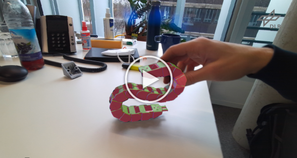
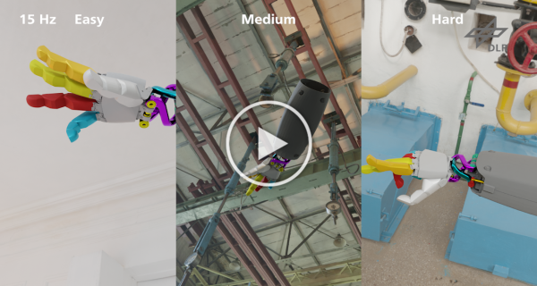
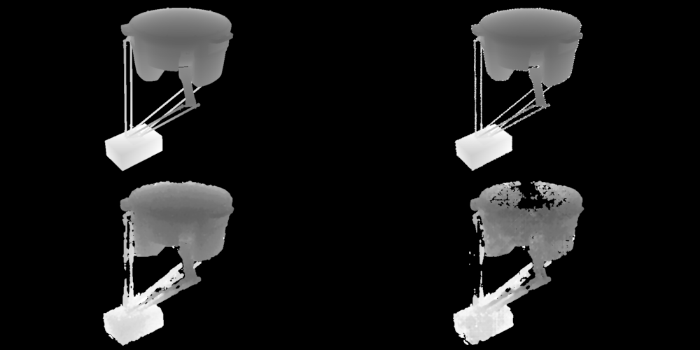

# Mb-ICG: Multi-body ICG

## Paper
A Multi-body Tracking Framework - From Rigid Objects to Kinematic Structures  
Manuel Stoiber, Martin Sundermeyer, Wout Boerdijk, Rudolph Triebel  
Submitted to IEEE Transactions on Pattern Analysis and Machine Intelligence  
[preprint](https://arxiv.org/pdf/2208.01502.pdf), [rtb_dataset](https://zenodo.org/record/7548537)


## Abstract
Kinematic structures are very common in the real world.
They range from simple articulated objects to complex mechanical systems.
However, despite their relevance, most model-based 3D tracking methods only consider rigid objects.
To overcome this limitation, we propose a flexible framework that allows the extension of existing 6DoF algorithms to kinematic structures.
Our approach focuses on methods that employ Newton-like optimization techniques, which are widely used in object tracking.
The framework considers both tree-like and closed kinematic structures and allows a flexible configuration of joints and constraints.
To project equations from individual rigid bodies to a multi-body system, Jacobians are used.
For closed kinematic chains, a novel formulation that features Lagrange multipliers is developed.
In a detailed mathematical proof, we show that our constraint formulation leads to an exact kinematic solution and converges in a single iteration.
Based on the proposed framework, we extend *ICG*, which is a state-of-the-art rigid object tracking algorithm, to multi-body tracking.
For the evaluation, we create a highly-realistic synthetic dataset that features a large number of sequences and various robots.
Based on this dataset, we conduct a wide variety of experiments that demonstrate the excellent performance of the developed framework and our multi-body tracker.


## Videos
<a href="https://youtu.be/0ORZvDDbDjA?t=12">
<p align="center">
 
    <br> 
    <em>Real-World Experiments</em>
</p>
</a>

<a href="https://youtu.be/0ORZvDDbDjA?t=166">
<p align="center">
 
    <br> 
    <em>The Robot Tracking Benchmark (RTB)</em>
</p>
</a>


## The Robot Tracking Benchmark (RTB)
The *Robot Tracking Benchmark (RTB)* is a synthetic dataset that facilitates the quantitative evaluation of 3D tracking algorithms for multi-body objects.
It is publicly available on [Zenodo](https://zenodo.org/record/7548537).
The dataset was created using the procedural rendering pipeline [BlenderProc](https://github.com/DLR-RM/BlenderProc).
It contains photo-realistic sequences with [HDRi lighting](https://polyhaven.com/hdris) and physically-based materials.
Perfect ground truth annotations for camera and robot trajectories are provided in the [BOP format](https://github.com/thodan/bop_toolkit/blob/master/docs/bop_datasets_format.md).
Many physical effects, such as motion blur, rolling shutter, and camera shaking, are accurately modeled to reflect real-world conditions.
For each frame, four depth qualities exist to simulate sensors with different characteristics.
While the first quality provides perfect ground truth, the second considers measurements with the distance-dependent noise characteristics of the *Azure Kinect* time-of-flight sensor.
Finally, for the third and fourth quality, two stereo RGB images with and without a pattern from a simulated dot projector were rendered.
Depth images were then reconstructed using *Semi-Global Matching (SGM)*.
<p align="center">

<br> 
<em>Multi-body objects included in the RTB dataset</em>
</p>

The benchmark features six robotic systems with different kinematics, ranging from simple open-chain and tree topologies to structures with complex closed kinematics.
For each robotic system, three difficulty levels are provided: *easy*, *medium*, and *hard*.
In all sequences, the kinematic system is in motion.
While for *easy* sequences the camera is mostly static with respect to the robot, *medium* and *hard* sequences feature faster and shakier motions for both the robot and camera.
Consequently, motion blur increases, which also reduces the quality of stereo matching.
Finally, for each object, difficulty level, and depth image quality, 10 sequences with 150 frames are rendered.
In total, this results in 108.000 frames that feature different kinematic structures, motion patterns, depth measurements, scenes, and lighting conditions.
In summary, the *Robot Tracking Benchmark* allows to extensively measure, compare, and ablate the performance of multi-body tracking algorithms, which is essential for further progress in the field.

<p align="center">

<br> 
<em>Depth image qualities provided in the RTB dataset</em>
</p>


## Training Data Generation
To generate your own data similar to sequences provided in the *RTB* dataset, please use the provided BlenderProc scripts in the following [directory](https://github.com/DLR-RM/3DObjectTracking/tree/master/Mb-ICG/data_generation).


## Code
The *Mb-ICG* tracker was fully integrated into the multi-body, multi-modality, and multi-camera tracking library *M3T*.
In contrast to *Mb-ICG*, *M3T* provides additional functionality, such as a keypoint-based texture modality, capabilities for multi-region tracking, and soft constraints.
Note that it was ensured that the evaluation results for *Mb-ICG* and *M3T* are exactly the same.
If you would like to reproduce results from our publication or use the tracker in your own application, please use *M3T's* code from the following [directory](https://github.com/DLR-RM/3DObjectTracking/tree/master/M3T).


## Evaluation
The [code](https://github.com/DLR-RM/3DObjectTracking/tree/master/M3T/examples) in `examples/evaluate_RTB_dataset.cpp` and `examples/parameters_study_RTB.cpp` was used for the evaluation on the [RTB dataset](https://zenodo.org/record/7548537).
To reproduce results, please download the dataset and adjust the `dataset_directory` in the source code.
Files for sparse viewpoint models will be created automatically and are stored in the specified `external_directory`.
To reproduce the evaluation results of *DART* on the *RTB* dataset, please unzip the `data/rtb_poses.zip` file from the following [folder](https://github.com/DLR-RM/3DObjectTracking/tree/master/M3T/data) and store its content in the respective `external_directory`.
In the code, you can then set `evaluator.set_evaluate_external(true);` and `evaluator.set_external_results_folder("dart");`.
Convergence experiments for the proposed constraints can be reproduced using `examples/constraint_convergence.cpp`.
To evaluate orthogonality constraints, which ensure that axes of reference frames are orthogonal, set the parameter in `include/m3t/constaint.h` to `kOrthogonalityConstraintExperiment = true`.
Results for the optimization time of the projected and constrained configuration over a varying number of bodies can be reproduced using `examples/optimization_time.cpp`.
In both experiments, outputs are generated that can be used together with the *LaTeX* package *PGFPlots* and that were used to generate the corresponding plots in the paper.


## Citation
If you find our work useful, please cite us with: 

```
@Article{Stoiber_2023_TPAMI,
    author = {Stoiber, Manuel and Sundermeyer, Martin and Boerdijk, Wout and Triebel, Rudolph},
    title  = {A Multi-body Tracking Framework - From Rigid Objects to Kinematic Structures},
    year   = {2023},
}
```
