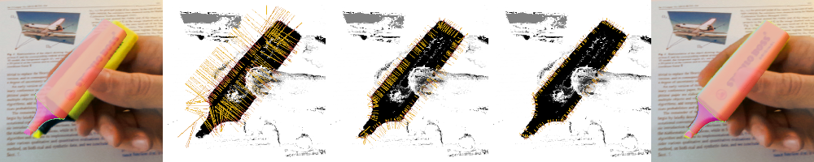

# SRT3D: Sparse Region-Based 3D Object Tracking



### Paper
SRT3D: A Sparse Region-Based 3D Object Tracking Approach for the Real World  
Manuel Stoiber, Martin Pfanne, Klaus H. Strobl, Rudolph Triebel, and Alin Albu-Schäffer  
Submitted to the International Journal of Computer Vision: [Paper](https://arxiv.org/abs/2110.12715)

### Abstract
Region-based methods have become increasingly popular for model-based, monocular 3D tracking of texture-less objects in cluttered scenes. However, while they achieve state-of-the-art results, most methods are computationally expensive, requiring significant resources to run in real-time. In the following, we build on our previous work and develop SRT3D, a sparse region-based approach to 3D object tracking that bridges this gap in efficiency. Our method considers image information sparsely along so-called correspondence lines that model the probability of the object's contour location. We thereby improve on the current state of the art and introduce smoothed step functions that consider a defined global and local uncertainty. For the resulting probabilistic formulation, a thorough analysis is provided. Finally, we use a pre-rendered sparse viewpoint model to create a joint posterior probability for the object pose. The function is maximized using second-order Newton optimization with Tikhonov regularization. During the pose estimation, we differentiate between global and local optimization, using a novel approximation for the first-order derivative employed in the Newton method. In multiple experiments, we demonstrate that the resulting algorithm improves the current state of the art both in terms of runtime and quality, performing particularly well for noisy and cluttered images encountered in the real world.

### Description of Content
This repository contains everything necessary to reproduce the results presented in our paper. This includes the evaluation on the RBOT and OPT datasets as well as the conducted parameters study. Source files for the `srt3d` library are stored in `src` and `include/srt3d`. Source files for the executables are stored in `examples`. For the evaluation and parameter study on the RBOT and OPT datasets, the code in `evaluate_rbot_dataset.cpp`, `parameters_study_rbot.cpp`, `evaluate_opt_dataset.cpp`, and `parameters_study_opt.cpp` was used. To reproduce our experiments, please download the [RBOT](http://cvmr.info/research/RBOT/) and [OPT](http://media.ee.ntu.edu.tw/research/OPT/) datasets and adjust the `dataset_directory` in the source code. Note that model files (e.g. `ape_model.bin`, `bakingsoda_model.bin`, ...) will be created automatically and are stored in the same folder as the `.obj` file of each object.

For real-world tracking, we provide code that allows either to directly track objects or to first record a sequence and then run the tracker on this recorded sequence. The code for this is provided in `run_on_camera_sequence.cpp`, `record_camera_sequence.cpp` and `run_on_recorded_sequence.cpp`. In our implementation, an Azure Kinect camera is used. If you don't want to use the Azure Kinect, you can disable the CMake option `USE_AZURE_KINECT`. For tracking, object parameters and directories in `run_on_camera_sequence.cpp` and `run_on_recorded_sequence.cpp` have to be adjusted. Note that by default, tracking will not start automatically. To start tracking, please press the `T` key on your keyboard. To stop the application press `Q`. If you would like to use another camera than the Azure Kinect, we encourage you to create a class similar to the `AzureKinectCamera` class in `src/azure_kinect_camera.cpp`.

### Usage
If you want to use our tracker for your own project, we would like to refer you to `run_on_camera_sequence.cpp` for how to set up the tracker and required objects. The following variables in `run_on_camera_sequence.cpp` should be considered in an initial set up:
* `model_path`: location where all object models, that are created automatically from an .obj file, are stored.
* `body_ptr`: contains all information associated with an object
    * `geometry_path`: path to `.obj` file
    * `geometry2body_pose`: transformation that allows to set a different frame of reference for the object than defined by the `.obj` file.
    * `world2body_pose`: initial transformation between camera and object.
    * `geometry_unit_in_meter`: scale factor to scale the unit used in the `.obj` file to meter.
    * `geometry_counterclockwise`: `true` if winding order of triangles in `.obj` is defined counter-clockwise.
    * `geometry_enable_culling`: `true` if faces that are not facing toward the camera should be culled.
    * `maximum_body_diameter`: maximum diameter in meter of a sphere that encapsulates the entire body.
    * `occlusion_mask_id`: unique number between 0 and 7 that is used to encode the object in occlusion_masks.
* `model_ptr`: contains all information associated with a model
    * `sphere_radius`: distance from camera to object center
    * `n_divides`: how often an icosahedron is devided (controls the number of template views)
    * `n_points`: number of contour points

## Citation
If you find our work useful, please cite us with: 

```
@Misc{Stoiber2021,
    author          = {Stoiber, Manuel and Pfanne, Martin and Strobl, Klaus H. and Triebel, Rudolph and Albu-Schaeffer, Alin},
    title           = {SRT3D: A Sparse Region-Based 3D Object Tracking Approach for the Real World},
    archiveprefix   = {arXiv},
    eprint          = {2110.12715},
    year            = {2021}
}
```


