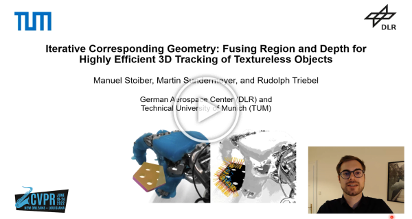
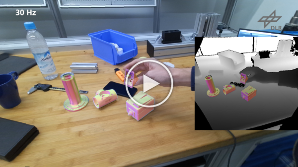
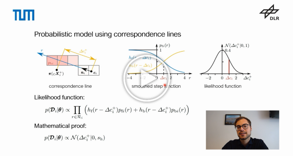
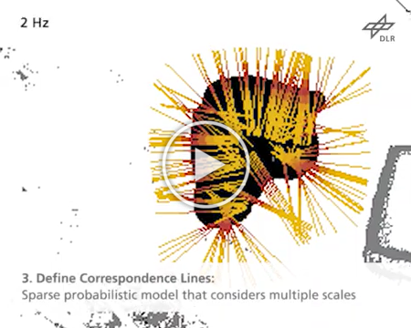

# 3D Object Tracking

Tracking objects and kinematic structures in 3D space and determining their poses and configurations is an essential task in computer vision. Its application ranges from augmented reality to robotic perception. Given consecutive image frames, as well as 3D meshes and kinematic information, the goal is to robustly estimate the rotation and translation of all bodies relative to a camera. While the problem has been thoroughly studied, many challenges such as partial occlusions, appearance changes, motion blur, background clutter, object ambiguity, and real-time requirements still exist.

In this repository, we will continuously publish algorithms and code of our ongoing research on 3D object tracking. The folders for the different algorithms include everything necessary to reproduce results presented in our papers. Note that the code for each new paper also includes an updated version of previous work. If you want to use our tracker in your own project or application, please use the code from the latest publication. Currently, the latest version of our code can be found in the folder [__M3T__](https://github.com/DLR-RM/3DObjectTracking/tree/master/M3T).

## Algorithms
* [__RBGT__](https://github.com/DLR-RM/3DObjectTracking/tree/master/RBGT)
Stoiber M, Pfanne M, Strobl KH, Triebel R, Albu-Schäffer A (2020) A Sparse Gaussian Approach to Region-Based 6DoF Object Tracking. In: Asian Conference on Computer Vision
* [__SRT3D__](https://github.com/DLR-RM/3DObjectTracking/tree/master/SRT3D)
Stoiber M, Pfanne M, Strobl KH, Triebel R, Albu-Schäffer A (2022) SRT3D: A Sparse Region-Based 3D Object Tracking Approach for the Real World. In: International Journal of Computer Vision
* [__ICG__](https://github.com/DLR-RM/3DObjectTracking/tree/master/ICG)
Stoiber M, Sundermeyer M, Triebel R (2022) Iterative Corresponding Geometry: Fusing Region and Depth for Highly Efficient 3D Tracking of Textureless Objects. In: Conference on Computer Vision and Pattern Recognition
* [__ICG+__](https://github.com/DLR-RM/3DObjectTracking/tree/master/ICG+)
Stoiber M, Elsayed M, Reichert AE, Steidle F, Lee D, and Triebel R (2023) Fusing Visual Appearance and Geometry for Multi-modality 6DoF Object Tracking. Submitted to: IEEE/RSJ International Conference on Intelligent Robots 2023
* [__Mb-ICG__](https://github.com/DLR-RM/3DObjectTracking/tree/master/Mb-ICG)
Stoiber M, Sundermeyer M, Boerdijk W, Triebel R (2023) A Multi-body Tracking Framework - From Rigid Objects to Kinematic Structures. Submitted to: IEEE Transactions on Pattern Analysis and Machine Intelligence
* [__M3T__](https://github.com/DLR-RM/3DObjectTracking/tree/master/M3T)
Stoiber M (2023) Closing the Loop: 3D Object Tracking for Advanced Robotic Manipulation. Dissertation submitted to the Technical University of Munich

## Videos

<a href="https://youtu.be/0ORZvDDbDjA">

 
      
    <em>A Multi-body Tracking Framework - From Rigid Objects to Kinematic Structures</em>

</a>

<a href="https://www.youtube.com/watch?v=NfNzxXupX54">

 
      
    <em>Fusing Visual Appearance and Geometry for Multi-Modality 6DoF Object Tracking</em>

</a>

<a href="https://www.youtube.com/watch?v=eYd_3TnJIaE">

 
      
    <em>Presentation CVPR 2022</em>

</a>

<a href="https://youtu.be/qMr1RHCsnDk">

 
      
    <em>Iterative Corresponding Geometry</em>

</a>

<a href="https://www.youtube.com/watch?v=Y-nFAuElE1I&ab_channel=DLRRMC">

 
     
    <em>Oral Presentation ACCV 2020</em>

</a>

<a href="https://www.youtube.com/watch?v=lwhxSRpwn3Y&ab_channel=DLRRMC">

 
     
    <em>A Sparse Gaussian Approach to Region-Based 6DoF Object Tracking</em>

</a>

<a href="https://www.youtube.com/watch?v=TkS0Wkd_0lA&ab_channel=DLRRMC">

 
     
    <em>A Sparse Gaussian Approach to Region-Based 6DoF Object Tracking</em>

</a>
