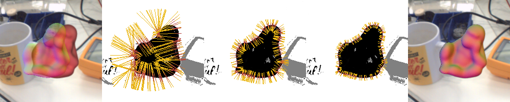

# Region-Based Gaussian Tracker (RBGT)

## A Sparse Gaussian Approach to Region-Based 6DoF Object Tracking
Manuel Stoiber, Martin Pfanne, Klaus H. Strobl, Rudolph Triebel, and Alin Albu-Schäffer

Accapted paper at ACCV 2020: [coming soon]()

### Abstract
We propose a novel, highly efficient sparse approach to region-based 6DoF object tracking that requires only a monocular RGB camera and the 3D object model. The key contribution of our work is a probabilistic model that considers image information sparsely along correspondence lines. For the implementation, we provide a highly efficient discrete scale-space formulation. In addition, we derive a novel mathematical proof that shows that our proposed likelihood function follows a Gaussian distribution. Based on this information, we develop robust approximations for the derivatives of the log-likelihood that are used in a regularized Newton optimization. In multiple experiments, we show that our approach outperforms state-of-the-art region-based methods in terms of tracking success while being about one order of magnitude faster. The source code of our tracker is publicly available.

### Source Code
coming soon

