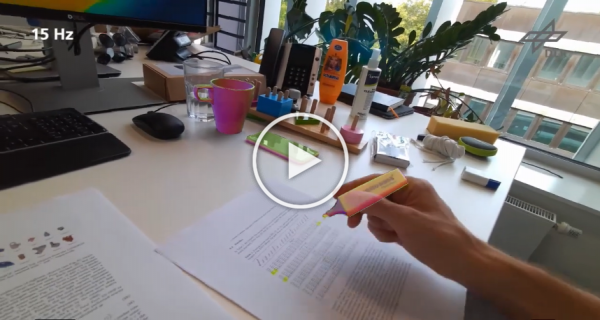

# Region-Based Gaussian Tracker (RBGT)

## A Sparse Gaussian Approach to Region-Based 6DoF Object Tracking
Manuel Stoiber, Martin Pfanne, Klaus H. Strobl, Rudolph Triebel, and Alin Albu-Schäffer

Accapted paper at ACCV 2020

## Overview


### Abstract
We propose a novel, highly efficient sparse approach to region-based 6DoF object tracking that requires only a monocular RGB camera and the 3D object model. The key contribution of our work is a probabilistic model that considers image information sparsely along correspondence lines. For the implementation, we provide a highly efficient discrete scale-space formulation. In addition, we derive a novel mathematical proof that shows that our proposed likelihood function follows a Gaussian distribution. Based on this information, we develop robust approximations for the derivatives of the log-likelihood that are used in a regularized Newton optimization. In multiple experiments, we show that our approach outperforms state-of-the-art region-based methods in terms of tracking success while being about one order of magnitude faster.

### Videos
<a href="https://www.youtube.com/watch?v=TkS0Wkd_0lA&ab_channel=DLRRMC">
<p align="center">
 
    <br>
    <em>Approach and Evaluation on RBOT Dataset</em>
</p>
</a>

<a href="https://www.youtube.com/watch?v=lwhxSRpwn3Y&ab_channel=DLRRMC">
<p align="center">
 
    <br>
    <em>Real-World Experiments</em>
</p>
</a>

### Description of Content
This repository contains everything necessary to reproduce the results presented in our paper. This includes the evaluation on the RBOT dataset, the ablation study presented in the supplementary, and the real-world experiments shown in the video. Source files for the `rbgt` library are stored in `src` and `include/rbgt`. Source files for the executables are stored in `examples`. For the evaluation on the RBOT dataset and the ablation study, the code in `evaluate_rbot_dataset.cpp` and `evaluate_ablation_study.cpp` was used. To reproduce our experiments, please download the [RBOT dataset](http://cvmr.info/research/RBOT/) and adjust the `dataset_path` in the source code. Note that model files (e.g. `ape_model.bin` and `ape_model.txt`) will be created automatically and are stored in the same folder as the `.obj` files of each object.

For real-world tracking, we provide code that allows either to directly track objects or to first record a sequence and then run the tracker on this recorded sequence. The code for this is provided in `run_on_camera_sequence.cpp`, `record_camera_sequence.cpp` and `run_on_recorded_sequence.cpp`. Both files were used in our own experiments and adapted according to the tracked objects. In all our experiments, an Azure Kinect camera was used. If you don't want to use the Azure Kinect, you can disable the CMake option `USE_AZURE_KINECT`. Note that by default, tracking will not start automatically. To start tracking, please press the `T` key on your keyboard. To stop the application press `Q`. If you would like to use another camera than the Azure Kinect, we encourage you to create a class similar to the `AzureKinectCamera` class in `src/azure_kinect_camera.cpp`.

### Usage
If you want to use our tracker for your own project, we would like to refer you to `run_on_camera_sequence.cpp` for how to set up the tracker and required objects. The following variables in `run_on_camera_sequence.cpp` should be considered in an initial set up:
* `model_path`: location where all object models, that are created automatically from an .obj file, are stored.
* `body_ptr`: contains all information associated with an object
    * `geometry_path`: path to `.obj` file
    * `geometry2body_pose`: transformation that allows to set a different frame of reference for the object than defined by the `.obj` file.
    * `world2body_pose`: initial transformation between camera and object.
    * `geometry_unit_in_meter`: scale factor to scale the unit used in the `.obj` file to meter.
    * `geometry_counterclockwise`: `true` if winding order of triangles in `.obj` is defined counter-clockwise.
    * `geometry_enable_culling`: `true` if faces that are not facing toward the camera should be culled.
    * `maximum_body_diameter`: maximum diameter in meter of a sphere that encapsulates the entire body.
    * `occlusion_mask_id`: unique number between 0 and 7 that is used to encode the object in occlusion_masks.
* `model_ptr`: contains all information associated with a model
    * `sphere_radius`: distance from camera to object center
    * `n_divides`: how often an icosahedron is devided (controls the number of template views)
    * `n_points`: number of contour points

## Citation
If you find our work useful, please cite us with: 

```
@inproceedings{stoiber2020,
  title={A Sparse Gaussian Approach to Region-Based {6DoF} Object Tracking},
  author={Stoiber, Manuel and Pfanne, Martin and Strobl, Klaus H. and Triebel, Rudolph and Albu-Schäffer, Alin},
  booktitle={Proceedings of the Asian Conference on Computer Vision (ACCV)},
  year={2020}
}
```


